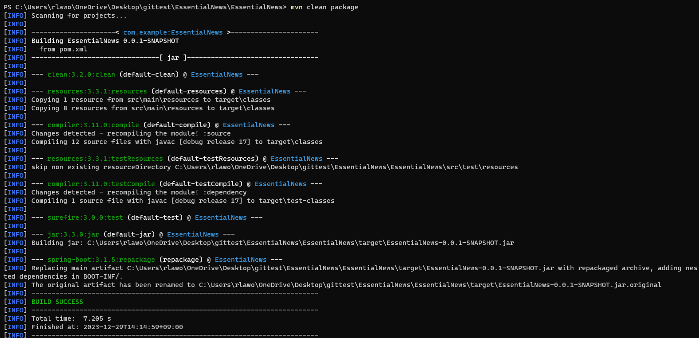
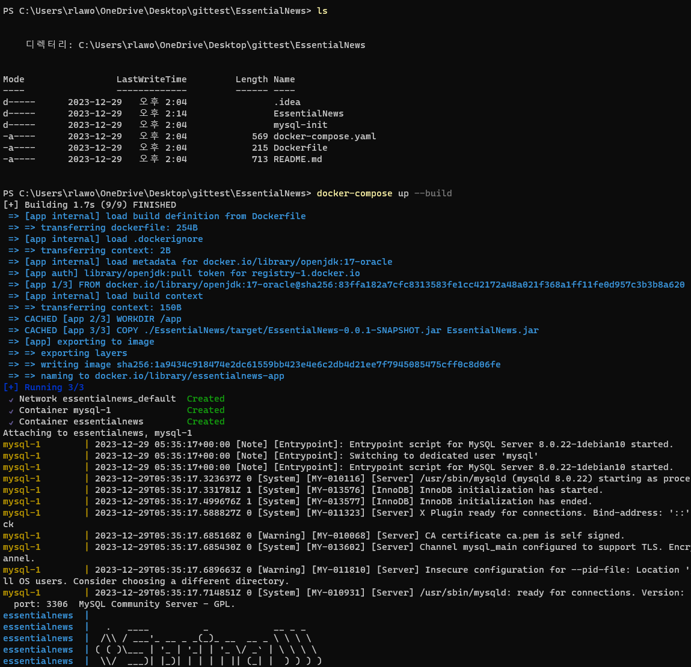
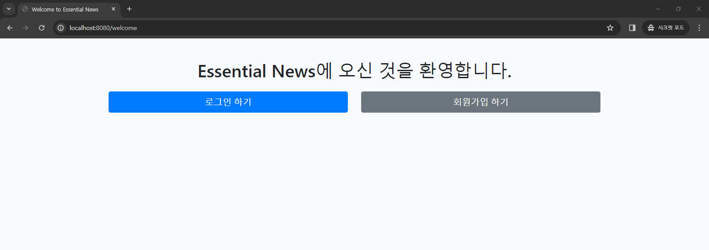

# Essential news project

## Overview
This project is designed to assist people who have limited time to search for relevant news. By entering a keyword of interest, users can quickly access both the search trends and a list of related news articles.

## How to start project with Docker

0. git clone

    ```git
    git clone https://github.com/kjh0work/EssentialNews.git
    ``` 

1. docker (윈도우용) 설치: [Docker][dockerdownlink]

[dockerdownlink]: https://www.docker.com/products/docker-desktop/ 

2. maven 설치 및 PATH 등록

    설치 : https://maven.apache.org/download.cgi

    버전 확인
    
    ```
    mvn -v
    ```

3. 코드 build 하기

    cd \EssentialNews\EssentialNews
    
    마지막 EssentialNews디렉토리에서 해야 합니다.
    ```
    mvn clean package
    ```
    </img><br/>


4. docker-compose (만일 윈도우가 아니라면 따로 설치해야 합니다.)

    ```
    docker-compose up --build
    ```
    </img><br/>
5. 접속 방법

    웹 브라우저에서 'localhost:8080/welcome'으로 접속 가능합니다.
    </img><br/>
